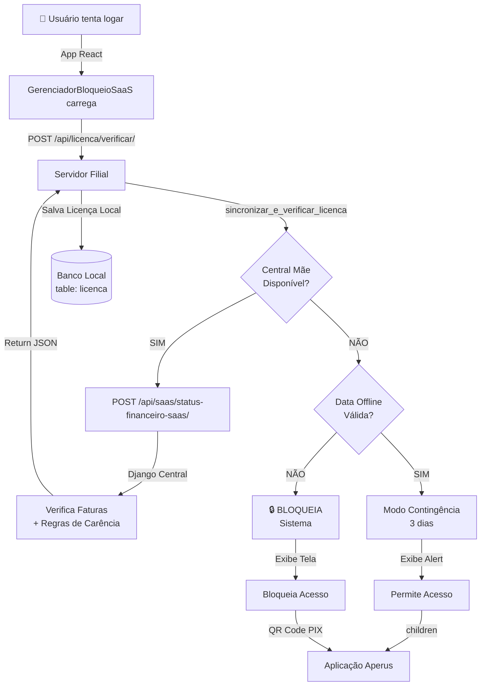

# 🚀 ROTEIRO DE IMPLEMENTAÇÃO - SISTEMA SaaS DE FATURAMENTO COM BLOQUEIO INTELIGENTE

**Data:** 02/06/2026  
**Status:** Pronto para Injeção  
**Versão:** 1.0 - Integração Completa  

---

## 📋 SUMÁRIO EXECUTIVO

Este pacote implementa um sistema de **controle de faturamento SaaS multi-cliente** com:
- ✅ Carência inteligente de 10 dias
- ✅ Proteção de bloqueio aos finais de semana
- ✅ Trava de segurança para bancos de teste
- ✅ Bloqueio manual por fim de contrato
- ✅ Motor de contingência offline (3 dias)
- ✅ Emissão de NFS-e (Código 1.05) para Patrocínio/MG
- ✅ QR Code PIX dinâmico com pooling de 30 segundos

---

## 🔧 ESTRUTURA DE IMPLEMENTAÇÃO

### **PARTE 1: MODELOS (Django Models)**

**Arquivo:** `api/models.py`  
**Ação:** ADICIONAR ao final do arquivo

#### Novo Modelo: `Licenca`
```python
class Licenca(models.Model):
    """Tabela local de licenciamento para gerenciar contingência offline"""
    id_licenca = models.AutoField(primary_key=True)
    chave_licenca = models.CharField(max_length=255, unique=True)
    data_validade = models.DateField()
    data_validade_offline = models.DateField(null=True, blank=True)
    status = models.CharField(max_length=20, choices=[('Ativa', 'Ativa'), ('Inativa', 'Inativa'), ('Bloqueada', 'Bloqueada')], default='Ativa')
    ultimo_check = models.DateTimeField(null=True, blank=True)
    modo_offline = models.BooleanField(default=False)
    
    class Meta:
        db_table = 'licenca'
        managed = False
    
    def __str__(self):
        return f"Licença {self.id_licenca} - {self.status}"
```

#### Novo Modelo: `Fatura`
```python
class Fatura(models.Model):
    """Tabela de faturas para controle de inadimplência"""
    id_fatura = models.AutoField(primary_key=True)
    cliente = models.ForeignKey(Cliente, on_delete=models.CASCADE)
    valor = models.DecimalField(max_digits=15, decimal_places=2)
    data_vencimento = models.DateField()
    data_emissao = models.DateField(auto_now_add=True)
    status = models.CharField(
        max_length=20,
        choices=[('ABERTA', 'Aberta'), ('ATRASADO', 'Atrasada'), ('PAGA', 'Paga'), ('CANCELADA', 'Cancelada')],
        default='ABERTA'
    )
    pix_copia_e_cola = models.TextField(blank=True, null=True)
    link_boleto = models.CharField(max_length=500, blank=True, null=True)
    nfse_numero = models.CharField(max_length=20, blank=True, null=True)
    nfse_emitida = models.BooleanField(default=False)
    
    class Meta:
        db_table = 'faturas'
        managed = False
        ordering = ['-data_vencimento']
    
    def __str__(self):
        return f"Fatura {self.id_fatura} - {self.cliente.nome_razao_social} - R${self.valor}"
    
    @property
    def dias_atraso(self):
        from django.utils import timezone
        if self.status == 'PAGA':
            return 0
        return (timezone.now().date() - self.data_vencimento).days
```

#### Atualização: Campo `Cliente`
```python
# ADICIONAR esses campos ao modelo Cliente existente:
bloqueio_manual = models.BooleanField(default=False, help_text="Bloqueio manual por fim de contrato")
email_responsavel = models.EmailField(blank=True, null=True)
```

---

### **PARTE 2: CENTRAL MÃE (Backend Django)**

**Arquivo:** `api/views_saas_financeiro.py`  
**Ação:** CRIAR novo arquivo

```python
import json
import datetime
from django.http import JsonResponse
from django.utils import timezone
from django.views.decorators.csrf import csrf_exempt
from api.models import Fatura, Cliente, Licenca
import requests

@csrf_exempt
def status_financeiro_saas(request):
    """
    Endpoint principal (Central Mãe) consultado pelas filiais.
    Gerencia bloqueios e travas de segurança.
    
    POST /api/saas/status-financeiro-saas/
    """
    if request.method != "POST":
        return JsonResponse({'status': 'erro', 'mensagem': 'Método inválido.'}, status=400)
        
    try:
        dados = json.loads(request.body)
        cnpj_cliente = dados.get('cnpj')
    except json.JSONDecodeError:
        return JsonResponse({'status': 'erro', 'mensagem': 'JSON inválido.'}, status=400)

    if not cnpj_cliente:
        return JsonResponse({'status': 'erro', 'mensagem': 'CNPJ não fornecido.'}, status=400)

    # 1. VERIFICAÇÃO DE BLOQUEIO MANUAL (FIM DE CONTRATO)
    cliente = Cliente.objects.filter(cpf_cnpj__icontains=cnpj_cliente).first()
    if cliente and cliente.bloqueio_manual:
        return JsonResponse({
            'bloqueio_manual': True, 
            'bloquear_sistema': True,
            'alerta_estagio': 'contrato_encerrado',
            'mensagem': 'Seu contrato foi encerrado. Contate o suporte.'
        })

    # 2. ISENÇÃO PARA BANCO DE TESTE / SEM FINANCEIRO
    faturas = Fatura.objects.filter(cliente__cpf_cnpj__icontains=cnpj_cliente)
    
    if not faturas.exists():
        return JsonResponse({
            'bloqueio_manual': False,
            'bloquear_sistema': False,
            'alerta_estagio': 'isento',
            'dias_atraso': 0,
            'dias_restantes_carencia': 999
        })

    # 3. VERIFICAÇÃO DE FATURAS ATRASADAS
    faturas_atrasadas = faturas.filter(status='ATRASADO').order_by('data_vencimento')
    
    if not faturas_atrasadas.exists():
        return JsonResponse({
            'bloqueio_manual': False,
            'bloquear_sistema': False,
            'alerta_estagio': 'em_dia',
            'dias_atraso': 0,
            'dias_restantes_carencia': 10
        })

    # 4. CÁLCULO DE CARÊNCIA (10 DIAS)
    fatura_mais_antiga = faturas_atrasadas.first()
    hoje = timezone.now().date()
    dias_atraso = (hoje - fatura_mais_antiga.data_vencimento).days

    bloquear_sistema = False
    alerta_estagio = 'suave'
    dias_restantes = 11 - dias_atraso

    # 5. REGRAS GRADUAIS
    if 1 <= dias_atraso <= 5:
        alerta_estagio = 'suave'
    elif 6 <= dias_atraso <= 10:
        alerta_estagio = 'critico'
    elif dias_atraso > 10:
        # 6. TRAVA CRÍTICA DE FIM DE SEMANA (0=Segunda, 5=Sábado, 6=Domingo)
        dia_semana_atual = hoje.weekday()
        if dia_semana_atual in [5, 6]:
            bloquear_sistema = False
            alerta_estagio = 'fim_de_semana'
        else:
            bloquear_sistema = True

    return JsonResponse({
        'bloqueio_manual': False,
        'bloquear_sistema': bloquear_sistema,
        'alerta_estagio': alerta_estagio,
        'dias_atraso': dias_atraso,
        'dias_restantes_carencia': max(0, dias_restantes),
        'fatura_pendente': {
            'valor': str(fatura_mais_antiga.valor),
            'vencimento': fatura_mais_antiga.data_vencimento.strftime('%d/%m/%Y'),
            'pix_copia_e_cola': fatura_mais_antiga.pix_copia_e_cola or '',
            'link_boleto': fatura_mais_antiga.link_boleto or ''
        }
    })


def enviar_nfse_fatura(fatura):
    """
    Motor de Emissão de NFS-e para a Prefeitura de Patrocínio/MG.
    Código de Serviço 1.05 (Licenciamento/Locação de Software).
    """
    cliente = fatura.cliente
    
    payload_nfse = {
        "IdentificacaoRps": {
            "Numero": str(fatura.id_fatura),
            "Tipo": "1"
        },
        "DataEmissao": timezone.now().strftime("%Y-%m-%dT%H:%M:%S"),
        "Status": "1",
        "Servico": {
            "Valores": {
                "ValorServicos": float(fatura.valor),
                "IssRetido": "2",
                "ItemListaServico": "1.05",
                "CodigoTributacaoMunicipio": "010500199"
            },
            "Discriminacao": f"PRESTACAO DE SERVICO DE LICENCIAMENTO E USO DO SISTEMA APERUS. FATURA ID {fatura.id_fatura}.",
            "CodigoMunicipio": "3148103"  # Patrocínio/MG
        },
        "Prestador": {
            "Cnpj": "00000000000000",  # Substituir pelo CNPJ da Aperus
            "InscricaoMunicipal": "000000"
        },
        "Tomador": {
            "CpfCnpj": {"Cnpj": cliente.cpf_cnpj.replace('.', '').replace('/', '').replace('-', '')},
            "RazaoSocial": cliente.nome_razao_social,
            "Endereco": {
                "Endereco": cliente.endereco or "",
                "Numero": cliente.numero or "",
                "Bairro": cliente.bairro or "",
                "CodigoMunicipio": cliente.codigo_municipio_ibge or "",
                "Uf": cliente.estado or "",
                "Cep": cliente.cep or ""
            },
            "Contato": {"Email": cliente.email_responsavel or ""}
        }
    }
    
    # Integração com seu transmissor ativo de NFS-e
    return payload_nfse
```

---

### **PARTE 3: SISTEMA FILHO (Backend Local)**

**Arquivo:** `api/licenciamento_service.py`  
**Ação:** SUBSTITUIR conteúdo existente

```python
import datetime
import requests
import re
from django.utils import timezone
from api.models import Licenca, EmpresaConfig

CENTRAL_MAE_URL = "http://localhost:8006/api/saas/status-financeiro-saas/"
TIMEOUT_CENTRAL = 5

def sincronizar_e_verificar_licenca():
    """
    Executado no login ou via checagem diária.
    Gerencia a tabela local de licenciamento para permitir o fluxo offline.
    
    Retorna:
        dict: Status de licença com flags de bloqueio
    """
    hoje = timezone.now().date()
    
    # 1. Recupera ou cria a licença local
    licenca_local, created = Licenca.objects.get_or_create(
        id_licenca=1,
        defaults={
            'chave_licenca': 'APERUS_LOCAL_LICENSE_KEY',
            'data_validade': hoje + datetime.timedelta(days=3),
            'status': 'Ativa'
        }
    )
    
    # 2. Carrega o CNPJ configurado localmente
    empresa = EmpresaConfig.objects.exclude(cpf_cnpj='').first() or EmpresaConfig.objects.first()
    if not empresa or not empresa.cpf_cnpj:
        return {
            "bloqueio_manual": False,
            "bloquear_sistema": True,
            "alerta_estagio": "erro_config",
            "mensagem": "CNPJ da empresa não configurado localmente."
        }
        
    cnpj_limpo = re.sub(r'\D', '', str(empresa.cpf_cnpj))
    
    try:
        # Tenta conectar à Central Mãe na nuvem
        resposta = requests.post(
            CENTRAL_MAE_URL,
            json={"cnpj": cnpj_limpo},
            timeout=TIMEOUT_CENTRAL
        )
        
        if resposta.status_code == 200:
            dados = resposta.json()
            
            # Se o cliente está liberado na nuvem, estende a validade offline por mais 3 dias
            if not dados.get('bloquear_sistema'):
                licenca_local.data_validade_offline = hoje + datetime.timedelta(days=3)
                licenca_local.ultimo_check = timezone.now()
                licenca_local.status = 'Ativa'
                licenca_local.modo_offline = False
                licenca_local.save()
            else:
                # Se a central retornar bloqueio, força bloqueio local imediato
                licenca_local.data_validade_offline = hoje - datetime.timedelta(days=1)
                licenca_local.ultimo_check = timezone.now()
                licenca_local.status = 'Bloqueada'
                licenca_local.save()
            
            return dados  # Retorna o status oficial em tempo real da nuvem

    except (requests.exceptions.ConnectionError, requests.exceptions.Timeout):
        # MODO CONTINGÊNCIA: Central fora ou cliente sem internet
        
        # Se a data local de offline ainda é válida, LIBERA em modo offline
        if licenca_local.data_validade_offline and hoje <= licenca_local.data_validade_offline:
            licenca_local.modo_offline = True
            licenca_local.save()
            
            return {
                "bloqueio_manual": False,
                "bloquear_sistema": False,
                "alerta_estagio": "modo_offline",
                "dias_atraso": 0,
                "mensagem": "Trabalhando em contingência offline."
            }
    
    # Se falhou a conexão E já expirou o prazo local de 3 dias: BLOQUEIA
    return {
        "bloqueio_manual": False,
        "bloquear_sistema": True,
        "alerta_estagio": "offline_expirado",
        "mensagem": "Sistema bloqueado. Conecte o servidor à internet para atualizar a licença."
    }


def obter_status_licenca():
    """
    Retorna o status da licença para a sessão do usuário logado.
    """
    return sincronizar_e_verificar_licenca()
```

---

### **PARTE 4: FRONT-END (React Component)**

**Arquivo:** `frontend/src/components/GerenciadorBloqueioSaaS.jsx`  
**Ação:** CRIAR novo arquivo

```jsx
import React, { useEffect, useState } from 'react';
import axios from 'axios';

// Opcional: se tiver qrcode instalado
// import QRCode from 'qrcode.react';

export default function GerenciadorBloqueioSaaS({ children, cnpjCliente }) {
    const [status, setStatus] = useState({
        bloquear_sistema: false,
        bloqueio_manual: false,
        alerta_estagio: 'em_dia'
    });
    const [fatura, setFatura] = useState(null);
    const [loading, setLoading] = useState(true);

    const checarStatusFinanceiro = async () => {
        try {
            const response = await axios.post('/api/licenca/verificar/', {
                cnpj: cnpjCliente
            });
            setStatus(response.data);
            if (response.data.fatura_pendente) {
                setFatura(response.data.fatura_pendente);
            }
        } catch (error) {
            console.error("Erro ao verificar licença", error);
        } finally {
            setLoading(false);
        }
    };

    useEffect(() => {
        checarStatusFinanceiro();

        // Pooling automático de 30 segundos se bloqueado
        if (status.bloquear_sistema) {
            const interval = setInterval(() => {
                checarStatusFinanceiro();
            }, 30000);
            return () => clearInterval(interval);
        }
    }, [status.bloquear_sistema]);

    // 1. BLOQUEIO MANUAL (CONTRATO ENCERRADO)
    if (status.bloqueio_manual) {
        return (
            <div style={{
                backgroundColor: '#111',
                color: '#fff',
                height: '100vh',
                display: 'flex',
                flexDirection: 'column',
                justifyContent: 'center',
                alignItems: 'center',
                textAlign: 'center',
                padding: '20px'
            }}>
                <h1 style={{ fontSize: '32px', marginBottom: '15px' }}>🔒 ACESSO SUSPENSO</h1>
                <p style={{ fontSize: '18px', color: '#aaa', maxWidth: '600px' }}>
                    Este sistema foi desativado devido ao encerramento do contrato de prestação de serviços.
                    Para reativação ou suporte, entre em contato com a equipe do <strong>Aperus</strong>.
                </p>
            </div>
        );
    }

    // 2. BLOQUEIO FINANCEIRO (INADIMPLÊNCIA > 10 DIAS)
    if (status.bloquear_sistema && !loading) {
        return (
            <div style={{
                backgroundColor: '#f8f9fa',
                height: '100vh',
                display: 'flex',
                justifyContent: 'center',
                alignItems: 'center',
                padding: '20px'
            }}>
                <div style={{
                    backgroundColor: '#fff',
                    padding: '40px',
                    borderRadius: '12px',
                    boxShadow: '0 4px 20px rgba(0,0,0,0.1)',
                    maxWidth: '500px',
                    width: '100%',
                    textAlign: 'center'
                }}>
                    <h2 style={{ color: '#dc3545', marginBottom: '10px' }}>💳 Assinatura Suspensa</h2>
                    <p style={{ color: '#6c757d', marginBottom: '25px' }}>
                        Identificamos uma pendência financeira vencida em <strong>{fatura?.vencimento}</strong>.
                    </p>

                    <div style={{
                        padding: '15px',
                        backgroundColor: '#fff3cd',
                        color: '#856404',
                        borderRadius: '6px',
                        marginBottom: '20px',
                        fontWeight: 'bold',
                        fontSize: '18px'
                    }}>
                        Valor Pendente: R$ {fatura?.valor}
                    </div>

                    {fatura?.pix_copia_e_cola && (
                        <div style={{
                            display: 'flex',
                            flexDirection: 'column',
                            alignItems: 'center',
                            marginBottom: '25px'
                        }}>
                            <p style={{ fontSize: '14px', fontWeight: 'bold', marginBottom: '10px' }}>
                                📱 Pague via PIX para liberação imediata:
                            </p>
                            
                            {/* QR Code (opcional - instale: npm install qrcode.react) */}
                            {/* <QRCode value={fatura.pix_copia_e_cola} size={180} /> */}
                            
                            <button
                                onClick={() => {
                                    navigator.clipboard.writeText(fatura.pix_copia_e_cola);
                                    alert('Código PIX copiado!');
                                }}
                                style={{
                                    marginTop: '15px',
                                    padding: '12px 24px',
                                    backgroundColor: '#007bff',
                                    color: '#fff',
                                    border: 'none',
                                    borderRadius: '6px',
                                    cursor: 'pointer',
                                    fontWeight: 'bold',
                                    fontSize: '14px'
                                }}
                            >
                                📋 Copiar Código PIX
                            </button>
                        </div>
                    )}

                    <p style={{ fontSize: '12px', color: '#999' }}>
                        ✅ O sistema será desbloqueado automaticamente em até 30 segundos após a confirmação do pagamento.
                    </p>
                </div>
            </div>
        );
    }

    // 3. RENDERIZAÇÃO NORMAL + BANNERS DE ALERTA
    return (
        <div>
            {status.alerta_estagio === 'critico' && (
                <div style={{
                    backgroundColor: '#fff3cd',
                    color: '#856404',
                    padding: '12px',
                    fontWeight: 'bold',
                    position: 'sticky',
                    top: 0,
                    zIndex: 9999,
                    textAlign: 'center',
                    borderBottom: '2px solid #ffc107'
                }}>
                    ⚠️ AVISO CRÍTICO: Sua assinatura possui pendências. O Aperus entrará em manutenção em {status.dias_restantes_carencia} dias.
                </div>
            )}

            {status.alerta_estagio === 'fim_de_semana' && (
                <div style={{
                    backgroundColor: '#e2e3e5',
                    color: '#383d41',
                    padding: '12px',
                    fontWeight: 'bold',
                    position: 'sticky',
                    top: 0,
                    zIndex: 9999,
                    textAlign: 'center',
                    borderBottom: '2px solid #6c757d'
                }}>
                    📢 NOTA: Detectamos atraso. O Aperus não bloqueia aos finais de semana. Regularize via PIX!
                </div>
            )}

            {status.alerta_estagio === 'modo_offline' && (
                <div style={{
                    backgroundColor: '#17a2b8',
                    color: '#fff',
                    padding: '8px',
                    fontSize: '13px',
                    textAlign: 'center',
                    borderBottom: '2px solid #0c5460'
                }}>
                    ℹ️ Modo Offline: Trabalhando sem conexão com servidor central.
                </div>
            )}

            {children}
        </div>
    );
}
```

---

### **PARTE 5: URLS E ENDPOINTS**

**Arquivo:** `api/urls.py`  
**Ação:** ADICIONAR ao final das importações

```python
# Adicionar à lista de importações:
from .views_saas_financeiro import status_financeiro_saas

# Adicionar aos padrões de URL:
path('saas/status-financeiro-saas/', status_financeiro_saas, name='status_financeiro_saas'),
path('licenca/verificar/', licencamento_service.sincronizar_e_verificar_licenca, name='verificar_licenca'),
```

---

### **PARTE 6: SETTINGS.INSTALLED_APPS**

**Arquivo:** `projeto_gerencial/settings.py`  
**Ação:** Verificar que esta app está registrada

```python
INSTALLED_APPS = [
    ...
    'api',  # Deve estar aqui
    ...
]
```

---

## 🔄 FLUXO DE EXECUÇÃO



---

## 🛠️ CHECKLIST DE IMPLEMENTAÇÃO

- [ ] **Criar Modelos**: Adicionar `Licenca` e `Fatura` em `models.py`
- [ ] **Criar Views SaaS**: Criar arquivo `views_saas_financeiro.py`
- [ ] **Atualizar Licenciamento**: Substituir `licenciamento_service.py`
- [ ] **Criar Component React**: Criar `GerenciadorBloqueioSaaS.jsx`
- [ ] **Adicionar URLs**: Registrar endpoints em `urls.py`
- [ ] **Envolver App**: Usar `<GerenciadorBloqueioSaaS>` em `App.jsx`
- [ ] **Migração Django**: Rodar `python manage.py makemigrations` e `migrate`
- [ ] **Testar Endpoints**: Validar POST `/api/saas/status-financeiro-saas/`
- [ ] **Testar React**: Verificar telas de bloqueio no navegador
- [ ] **Testar Offline**: Simular desconexão da central

---

## 📊 TABELAS REQUIRED

```sql
-- Criar se não existir:
CREATE TABLE licenca (
    id_licenca INT AUTO_INCREMENT PRIMARY KEY,
    chave_licenca VARCHAR(255) UNIQUE,
    data_validade DATE,
    data_validade_offline DATE,
    status VARCHAR(20),
    ultimo_check DATETIME,
    modo_offline BOOLEAN DEFAULT 0
);

CREATE TABLE faturas (
    id_fatura INT AUTO_INCREMENT PRIMARY KEY,
    cliente_id INT,
    valor DECIMAL(15, 2),
    data_vencimento DATE,
    data_emissao DATE,
    status VARCHAR(20),
    pix_copia_e_cola LONGTEXT,
    link_boleto VARCHAR(500),
    nfse_numero VARCHAR(20),
    nfse_emitida BOOLEAN DEFAULT 0,
    FOREIGN KEY (cliente_id) REFERENCES clientes(id_cliente)
);

-- Adicionar campos a tabela clientes se não existir:
ALTER TABLE clientes ADD COLUMN bloqueio_manual BOOLEAN DEFAULT 0;
ALTER TABLE clientes ADD COLUMN email_responsavel VARCHAR(100);
```

---

## 🔐 VARIÁVEIS DE AMBIENTE

Adicionar ao `.env`:

```bash
# Central Mãe SaaS
CENTRAL_MAE_URL=http://localhost:8006/api/saas/status-financeiro-saas/
CENTRAL_MAE_TIMEOUT=5

# NFS-e Patrocínio/MG
NFSE_CNPJ_APERUS=00000000000000  # Substituir pelo seu CNPJ
NFSE_IM_APERUS=000000             # Substituir pela sua IM
NFSE_CODIGO_MUNICIPIO=3148103     # Patrocínio/MG

# PIX (Integração com seu provedor)
PIX_CHAVE_ESTAGIO=seu-pix@email.com
```

---

## 🚀 PRÓXIMOS PASSOS

1. **Validar Estrutura**: Execute `python manage.py check`
2. **Rodar Migrações**: `python manage.py migrate api`
3. **Testar Central Mãe**: POST para `/api/saas/status-financeiro-saas/` com JSON válido
4. **Testar Filial**: Abrir React e logar
5. **Documentar Respostas**: Ajustar conforme feedback

---

## 📞 SUPORTE

- **Erro 400 JSON**: Verificar payload no POST
- **Erro 404 Endpoint**: Registrar URL em `urls.py`
- **Erro 500 Models**: Rodar `makemigrations` + `migrate`
- **React não bloqueia**: Verificar `GerenciadorBloqueioSaaS` está envolvendo `children` em App.jsx

---

**FIM DO ROTEIRO**  
✅ **Pronto para injetar via Antigravity!**
