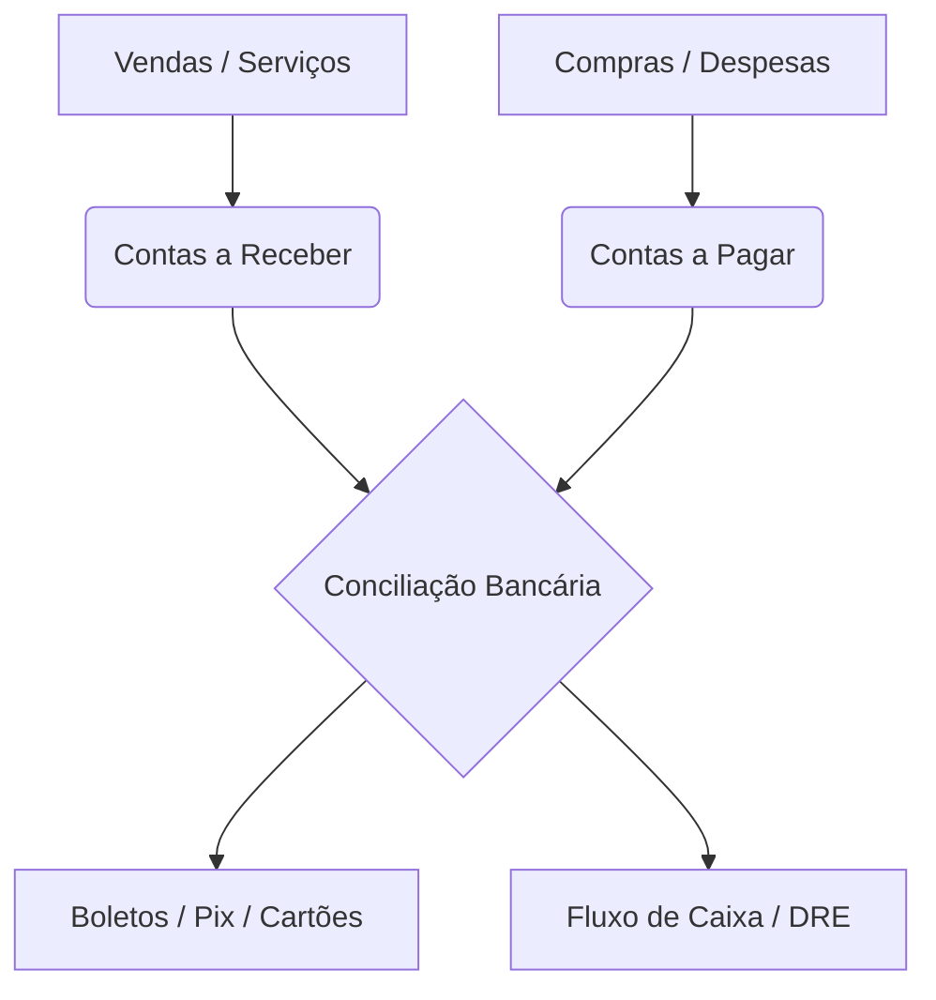

# Documentação Técnica e Funcional do Sistema Aperus

O **Sistema Aperus** é uma plataforma integrada de ERP (Enterprise Resource Planning), gestão fiscal, financeira, logística e operacional, desenvolvida sob uma arquitetura moderna e escalável. 

## 🏗️ Arquitetura do Sistema
O ecossistema do Aperus é composto pelas seguintes tecnologias:
* **Frontend**: React (v18.2) com bundler Vite, utilizando a biblioteca de componentes Material UI (MUI v5) para uma interface responsiva, fluida e de alta usabilidade.
* **Desktop Wrapper**: Electron, permitindo a execução do sistema em ambiente desktop de forma nativa e integrada ao hardware local.
* **Backend**: Django REST Framework (Python 3) fornecendo APIs síncronas de alto desempenho.
* **Assinador Fiscal**: Java Bridge (`XmlSigner`) integrado para assinaturas digitais de documentos fiscais sob o padrão oficial da SEFAZ (SHA-1 / RSA-SHA1).

---

## 📂 Módulos do Sistema e Seus Recursos

Abaixo estão detalhados os módulos e recursos do sistema Aperus, organizados por áreas de atuação no negócio.

### 🚚 1. Logística, Transporte e Emissão Fiscal
Este é um dos núcleos mais robustos do sistema, fornecendo conformidade total com as regras fiscais de transporte e movimentação de mercadorias no padrão **v4.00 da SEFAZ**.

| Recurso / Módulo | Descrição Funcional |
| :--- | :--- |
| **CT-e 4.00 (Conhecimento de Transporte)** | Emissão de Conhecimentos de Transporte Eletrônicos (Modelo 57). Suporta o fluxo de emissão normal, complementar de valores, inutilização e cancelamento. |
| **CT-e Contingência (SVC-SP)** | Envio automático ou forçado para a SEFAZ Virtual de Contingência de São Paulo (tpEmis: 8), permitindo faturar mesmo quando o servidor da SEFAZ/MG estiver fora do ar. |
| **Resolução de Duplicidade (CT-e)** | Assistente inteligente que extrai via Regex o protocolo e chave da mensagem de erro 539 da SEFAZ, reconstrói o `cteProc` assinado localmente e autoriza a nota no banco sem duplicar. |
| **MDFe (Manifesto de Carga)** | Geração de Manifesto de Documentos Fiscais Eletrônicos (Modelo 58), encerramento de manifestos, cancelamento e inclusão de condutores em trânsito. |
| **NF-e / NFC-e (Venda & Consumidor)** | Emissão de Nota Fiscal Eletrônica (Modelo 55) e Nota Fiscal de Consumidor Eletrônica (Modelo 65) com suporte a contingência offline (tpEmis: 9). |
| **Manifestação do Destinatário** | Consulta de notas emitidas contra o CNPJ da empresa, permitindo realizar a ciência da operação, confirmação, desconhecimento ou operação não realizada. |
| **Mapa e Carga** | Painel logístico de roteirização e consolidação de fretes para agrupamento de despachos por veículos ou rotas de destino. |

> [!IMPORTANT]
> A emissão de CT-e v4.00 utiliza o assinador híbrido Java/Python nativo garantindo criptografia compatível com as exigências da SEFAZ em ambiente síncrono.

---

### 🌾 2. Gestão do Agronegócio (Agro)
Módulo especializado voltado para produtores, cooperativas e tradings, integrando a operação física de grãos com o faturamento fiscal.

* **Agro Safras e Contratos**: Cadastro de safras, contratos de compra e venda de grãos com fixação de preços, controle de royalties e taxas de armazenagem.
* **Operacional Agrícola**: Acompanhamento físico de colheita, pesagens, entrada e saída de grãos por talhões e propriedades.
* **Balanças Rodoviárias**: Integração direta com balanças eletrônicas rodoviárias para captação automática de peso bruto e tara de caminhões de carga.
* **Agro Whatsapp**: Canal de comunicação e notificações automatizadas de pesagem e saldo de contratos para parceiros e produtores rurais.
* **Conversões de Medida**: Mapeamento de fatores de conversão dinâmicos de grãos (saca de 60kg, toneladas, bushels) para precisão no inventário.

---

### 💰 3. Módulo Financeiro e Cobrança
Gestão completa do fluxo de caixa e integração com as instituições bancárias.

* **Boletos Bancários**: Emissão, registro, e leitura de arquivos de retorno bancário (CNAB 240/400) para homologação e baixa automatizada.
* **Integração Pix**: Geração de QR Code Pix estático e dinâmico integrado diretamente à venda e conferência em tempo real com conciliação.
* **Cartões & Cheques**: Controle de recebíveis de cartões (crédito/débito), taxas de adquirentes, fluxo de antecipação e custódia física de cheques de clientes.
* **Conciliação Automatizada**: Importação de extratos bancários padrão OFX e cruzamento inteligente de lançamentos com o financeiro local.
* **DRE (Demonstração do Resultado)**: Relatório gerencial de lucros e perdas estruturado por planos de contas e centros de custos.

---

### 🛍️ 4. Vendas, CRM e Relacionamento
Recursos ágeis voltados para otimização de faturamento e retenção de carteira de clientes.

* **Venda Rápida (PDV)**: Frente de caixa extremamente veloz e otimizado para teclado, com emissão de NFC-e síncrona acoplada.
* **CRM (Gestão de Relacionamento)**: Funil de vendas, acompanhamento de leads, agendamento de follow-ups e histórico consolidado do cliente.
* **Cotações Públicas**: Criação de cotações que podem ser respondidas diretamente via link público por fornecedores externos para compras eficientes.
* **Programa de Cashback**: Configuração de percentual de cashback e validade de bônus gerados em vendas, rastreados por relatórios detalhados de resgate.
* **Trocas e Devoluções**: Assistente de troca rápida e emissão automática de NF-e de devolução de entrada/saída respeitando os impostos originais.

---

### 🔧 5. Prestação de Serviços, OS e RH
Controle administrativo de prestadores de serviços, oficinas e assistência técnica.

* **Ordem de Serviço (OS)**: Gestão de ordens de serviço contendo peças, serviços (mão de obra), equipamentos vinculados, técnicos responsáveis e controle de status de execução.
* **Equipamentos e Frota**: Cadastro de veículos e equipamentos dos clientes, contendo histórico completo de manutenções e intervenções realizadas.
* **Ponto Eletrônico e RH**: Registro de ponto diário de colaboradores integrado com regras de horas extras, banco de horas e cadastro de funcionários.
* **Produção Industrial**: Mapeamento de receitas de fabricação, ordens de produção e controle de consumo de insumos na industrialização.

---

### 🏨 6. Módulos de Especialidades de Mercado
O Aperus atende a nichos específicos de mercado sem a necessidade de softwares adicionais:

* **Comandas e Mesas**: Mapeamento visual de mesas, lançamento de comandas de consumo, junção de mesas e controle de cozinha para bares/restaurantes.
* **Hotel PMS**: Controle de ocupação hoteleira, mapa de reservas (check-in/check-out), tarifários flexíveis e faturamento de frigobar.
* **Veterinária & Pet Shop**: Prontuário clínico de animais de estimação, agendamento de consultas/vacinas e controle de serviços de banho e tosa.

---

### 🤖 7. Inteligência Artificial e Administração SaaS
* **Assistente IA (Chatbot)**: Chatbot inteligente integrado na interface do sistema que analisa relatórios operacionais, fornece resumos financeiros e auxilia na tomada de decisão do gestor.
* **Multi-Tenant (SaaS Admin)**: Painel de administração geral da plataforma para controle de tenants, faturamento das assinaturas dos clientes e mapeamento de domínios.
* **Segurança e Backup**: Ferramentas integradas de backup programado em nuvem e exportação periódica de arquivos XML fiscais.
