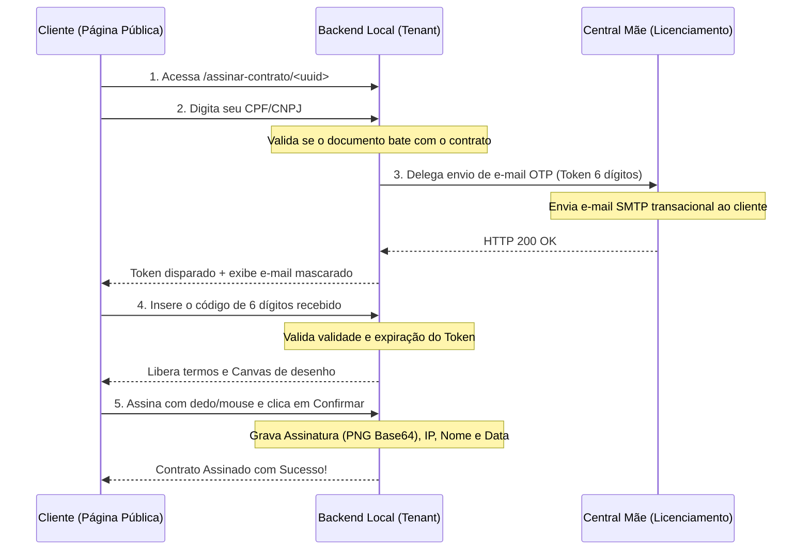

# Documentação do Sistema Aperus SaaS/ERP

Este documento consolida a arquitetura de software, a infraestrutura multi-tenant, os módulos de negócio e a estrutura do ecossistema do **Aperus**.

---

## 1. Visão Geral do Ecossistema

O **Aperus** é uma plataforma integrada de ERP (Enterprise Resource Planning) e SaaS (Software as a Service) voltada para gestão empresarial, automação comercial, emissão fiscal (NF-e, NFC-e, CT-e, MDF-e, NFS-e) e diversos módulos verticais (Agronegócio, Hotelaria, Produção PCP, Recursos Humanos e Ordens de Serviço).

### Arquitetura de Projetos e Repositórios
O ecossistema é dividido em três ambientes executados em paralelo através de portas distintas no Windows:

1. **Central/Mãe (`aperus_mae`) - Porta 8006**
   * **Função:** Centralizador de licenças do SaaS, controle financeiro de mensalidades dos clientes, gerenciamento de gabaritos customizados e serviços compartilhados de infraestrutura (como o microserviço central de geração de voz por IA e o disparo de e-mails transacionais delegados).
   * **URL de Produção:** `central.aperus.com.br`

2. **Sistema Filial/Instância Padrão (`SistemaAperus`) - Porta 8005**
   * **Função:** O núcleo da aplicação de ERP comercial usado pelas filiais e o código base para novas distribuições.
   * **URL de Produção:** `sistema.aperus.com.br`

3. **Instâncias/Tenants Independentes (`arquivos_clientes/...`) - Porta 8007**
   * **Função:** Instâncias isoladas em banco de dados e arquivos para clientes de grande porte (ex: `aperus_amerpusinformatica`). Eles se comunicam com a Central Mãe para validação de licença em background de forma transparente.

---

## 2. Tecnologias Utilizadas

* **Backend:** Python 3.12+ / Django Framework / Django Rest Framework (DRF)
* **Frontend:** React 18 / Vite / Material-UI (MUI) / React Router (`BrowserRouter`)
* **Banco de Dados:** SQLite (padrão local de cada instância) / PostgreSQL (suporte em produção)
* **Comunicação:** Axios (REST HTTP) / JSON Web Tokens (SimpleJWT para autenticação)
* **Serviço de Estáticos:** Django WhiteNoise (`CompressedManifestStaticFilesStorage`) com cache de longa duração imutável para assets compilados por hash.

---

## 3. Estrutura de Banco de Dados (Principais Modelos)

O sistema possui uma rica modelagem de dados dividida em subsistemas:

### 💼 Core, Clientes e Vendas
| Modelo | Função |
| :--- | :--- |
| `Cliente` | Cadastro de clientes, controle de limite de crédito e dados de contato. |
| `Fornecedor` | Cadastro de fornecedores e controle de compras. |
| `Venda` | Registro cabeçalho de vendas, status de faturamento e integração fiscal. |
| `VendaItem` | Itens vinculados à venda, cálculo de alíquotas e descontos. |
| `Devolucao` / `Troca` | Fluxo de logística reversa e geração de crédito ao consumidor. |

### 📦 Produtos e Estoque
| Modelo | Função |
| :--- | :--- |
| `Produto` | Cadastro de mercadorias, código de barras (EAN), preço de custo e venda. |
| `Estoque` | Saldo físico atualizado por depósito (`Deposito`). |
| `EstoqueMovimentacao` | Histórico (Kardex) de entradas, saídas e transferências de mercadorias. |
| `LoteProduto` | Controle de rastreabilidade de validade e fabricação (ex: medicamentos, perecíveis). |

### 📊 Financeiro e Cobrança
| Modelo | Função |
| :--- | :--- |
| `FinanceiroBancario` | Extrato de movimentação bancária da empresa. |
| `FinanceiroConta` | Contas a pagar e receber do financeiro. |
| `FormaPagamento` | Configurações de recebimento (Dinheiro, Cartão, Boleto, PIX). |
| `Boleto` / `CobrancaPix` | Emissão e conciliação bancária direta. |

### 🛠️ Módulos de Nicho (Verticais)
* **Agronegócio:** `Safra`, `ContratoAgricola`, `Talhao`, `DespesaAgro`, `MaquinarioAgro`.
* **Hotelaria:** `Quarto`, `Reserva`, `TipoQuarto`, `ConsumoQuarto`, `Comodidade`.
* **Recursos Humanos:** `Funcionario`, `RegistroPonto`, `Holerite`, `EntregaEPI`.
* **Produção (PCP):** `OrdemProducao`, `ComposicaoProduto` (Ficha Técnica).
* **Ordens de Serviço (OS):** `OrdemServico`, `Tecnico`, `OsFoto`, `OsAssinatura`.

---

## 4. Integrações de Serviços Especiais

### 💬 WhatsApp Integration
* O sistema possui uma fila assíncrona (`FilaWhatsApp`) que armazena mensagens transacionais (como links de cobrança, PDFs de notas e links de assinatura). 
* Um worker em segundo plano consome esta fila e realiza o envio utilizando a **API Oficial do Cloud WhatsApp (Meta)** ou delega via listener local do **WhatsApp Desktop** (configurável no `.env`).

### 📡 Monitor SEFAZ (Tecnospeed)
* O monitoramento da disponibilidade dos servidores estaduais da SEFAZ para NF-e/NFC-e é realizado de forma autônoma pela classe `TecnospeedMonitorService`. 
* Ele dispara alertas sonoros no frontend do usuário quando há instabilidade e remove o alerta assim que a comunicação é reestabelecida.

### 🛡️ Licenciamento SaaS
* O backend de cada tenant executa periodicamente um ping contra o endpoint `/api/saas/status-financeiro-saas/` da Central Mãe.
* Se a licença estiver expirada ou bloqueada por inadimplência, a API local bloqueia as rotas de faturamento e redireciona os operadores.

### 📊 Telemetria e Monitoramento de Recursos
* A Central Mãe executa um serviço em segundo plano de telemetria utilizando a biblioteca `psutil` para ler a saúde do servidor físico (Uso de RAM, CPU e espaço livre em disco no `C:\`).
* Esse monitoramento inclui a leitura contínua do tamanho dos arquivos de banco de dados SQLite de cada tenant em `arquivos_clientes`, prevenindo gargalos de armazenamento e detectando comportamentos anômalos.

---

## 5. Fluxo de Assinatura Digital (Contrato de Responsabilidade)
*Recentemente desenvolvido e integrado de ponta a ponta.*

Este recurso permite gerar um contrato e enviar um link público para assinatura digital do cliente final sem necessidade de login.



### Detalhes Técnicos da Assinatura:
* **Fino Acabamento (Canvas):** O painel de assinatura utiliza canvas HTML5 integrado com escutas manuais de eventos de toque (`touchstart`, `touchmove`) configuradas como **não-passivas** (`passive: false`). Isso anula a rolagem de tela nos dispositivos móveis (iOS/Android) durante a assinatura. O traço do desenho é configurado em `2px` para garantir elegância visual.
* **Certificado PDF/Impressão:** A tela de visualização do contrato no ERP exibe o documento formatado como uma folha A4 com um selo oficial de autenticidade jurídica. O sistema dispõe de um botão **"Imprimir / Salvar PDF"** que abre um template formatado sem cabeçalhos de sistema e dispara o diálogo de impressão nativo do browser.

---

## 6. Regras de Ouro de Negócio (Fiscal e Crédito)

Para manter a consistência fiscal e a segurança financeira nas operações do ERP:
* **Abas Tributárias Estáticas:** O cálculo tributário do PDV e faturamento é chaveado de forma estática com base no perfil tributário da empresa (Simples Nacional vs. Regime Normal/Lucro Presumido ou Real). Isso garante que o preenchimento de campos como CSOSN ou CST de ICMS respeite as abas e regramentos do regime ativo da empresa.
* **Trava de Venda a Prazo para Consumidor Final:** Vendas faturadas a prazo são bloqueadas se o cliente for identificado como "Consumidor Final" genérico ou se não possuir limite de crédito pré-aprovado (`CreditoCliente`) com saldo disponível ativo no sistema.

---

## 7. Variáveis de Ambiente (.env)

Cada projeto (`SistemaAperus`, `aperus_mae` e instâncias de clientes) possui um arquivo `.env` para carregar as chaves de configuração locais:

| Chave | Exemplo | Descrição |
| :--- | :--- | :--- |
| `PORT` | `8005` (Filial), `8006` (Mãe), `8007` (Tenant) | Porta TCP em que a instância local do Django irá escutar. |
| `SEFAZ_UF` | `MG` / `SP` | Estado de emissão fiscal padrão para checagem de status. |
| `WHATSAPP_TOKEN` | `EAAG...` | Token de autenticação da API Cloud da Meta para disparo de mensagens. |
| `WHATSAPP_DESKTOP_LISTENER_ENABLED` | `False` / `True` | Se habilitado, tenta interceptar e disparar pelo WhatsApp Desktop nativo. |
| `MAINTENANCE_MODE` | `False` / `True` | Se `True`, bloqueia todas as rotas e exibe tela de manutenção no frontend. |
| `DATABASE_URL` | `sqlite:///db.sqlite3` / `postgres://...` | String de conexão para o banco de dados. |

---

## 8. Comandos e Manutenção do Servidor (Administração)

O sistema roda sob o ecossistema do **Windows Services**. A manutenção de backend e frontend requer os seguintes passos:

### Atualização do Frontend (React)
Toda alteração de interface deve ser compilada e atualizada nos estáticos do Django:
```powershell
# 1. Compila o projeto filial
npm --prefix C:\APERUS\SistemaAperus\frontend run build

# 2. Copia os arquivos compilados para o Tenant
Copy-Item -Path C:\APERUS\SistemaAperus\frontend\dist\* -Destination C:\APERUS\arquivos_clientes\aperus_amerpusinformatica\frontend\dist -Recurse -Force

# 3. Roda collectstatic nos Django backends correspondentes
C:\APERUS\SistemaAperus\.venv\Scripts\python.exe C:\APERUS\SistemaAperus\manage.py collectstatic --noinput
C:\APERUS\arquivos_clientes\aperus_amerpusinformatica\venv\Scripts\python.exe C:\APERUS\arquivos_clientes\aperus_amerpusinformatica\manage.py collectstatic --noinput
```

### Reiniciando os Servidores no Windows
Após qualquer modificação no código Python (`views.py`, `models.py`, `serializers.py`), os serviços devem ser reiniciados via PowerShell (como Administrador) para atualizar a memória:
```powershell
Restart-Service -Name AperusServerAmerpus, AperusServerFilho, AperusServerMae -Force
```
